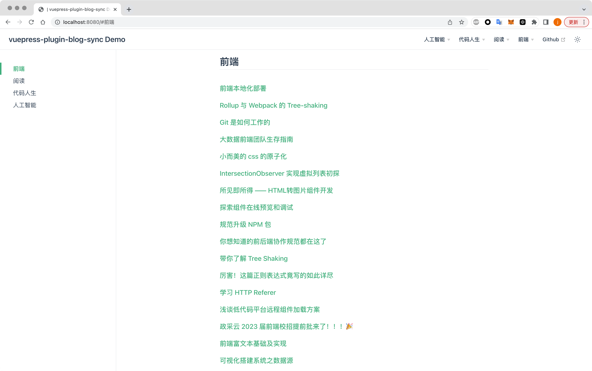

# Welcome to vuepress-plugin-blog-sync 👋
[](https://www.npmjs.com/package/vuepress-plugin-blog-sync)
[](#)

> 输入网站基本信息，一键生成 vuepress2文档站/ Input blog site info, generate vuepress2 site automatically


## 安装
```bash
npm i vuepress-plugin-blog-sync
```

## 使用
> 只支持[vuepress 2.x](https://v2.vuepress.vuejs.org/)，0.x和1.x不支持

最小化配置如下

```ts
// vuepress.config.ts
import { defaultTheme, defineUserConfig } from 'vuepress'
import { blogSyncPlugin } from 'vuepress-plugin-blog-sync'

export default defineUserConfig({
// ....
  plugins: [
    plugins: [
    blogSyncPlugin({
      syncConfig: {
        type: 'juejin',
        userId: '3456520257288974',
      },
    }),
  ]
  ],
// ....
})
```

效果✨ [Demo](https://blog.flytam.vip/vuepress-plugin-blog-sync)

将[政采云掘金博客](https://juejin.cn/user/3456520257288974/posts)一键生成vuepress2页面



## 插件配置

- syncConfig
  - 默认值（无，必选参数）
  - 详情
    - 需要同步的页面信息，透传`csdnsynchexo`node api的配置，[参考](https://github.com/flytam/CsdnSyncHexo#%E6%94%AF%E6%8C%81%E5%B9%B3%E5%8F%B0)。传数组时表示可以对多个博客进行拉取
    - 定义参数
      - `SyncConfig | SyncConfig[]`


- catalog
  - 默认值（true）
  - 详情
    - 是否自动生成目录页，默认生成
  - 参数定义
    - `pageOptions`，透传vuepress配置，可配置生成的目录页路径，默认`/`
    - `generateContent?: (categoryMeta: BlogMetaContext) => string
  } | false`，自定义目录页结构

- navbar
  - 默认值（true）
  - 详情
    - 是否自动生成navbar，默认根据category生成
  - 参数定义
    - `custom?: (originNavbarConfig: DefaultThemeData['navbar'], blogMetaContext: BlogMetaContext) => DefaultThemeData['navbar']`，可用于自定义修改导航生成逻辑

## Author

👤 **flytam**

* Website: https://blog.flytam.vip
* Github: [@flytam](https://github.com/flytam)

## 🤝 Contributing

Contributions, issues and feature requests are welcome!

Feel free to check [issues page](https://github.com/flytam/vuepress-plugin-blog-sync/issues). 

## Show your support

Give a ⭐️ if this project helped you!